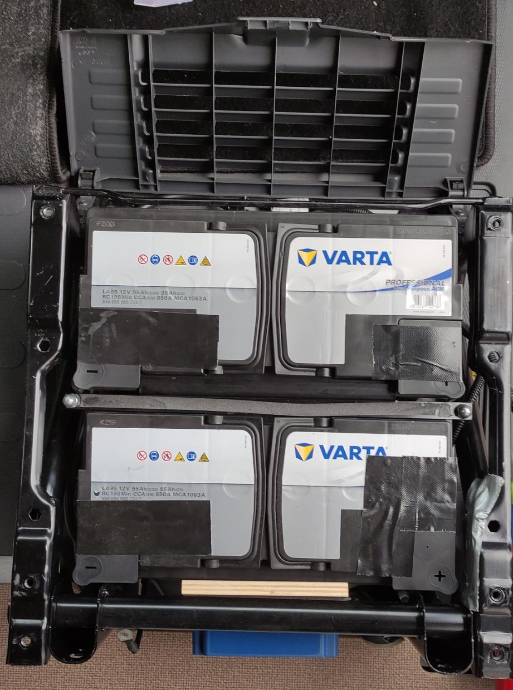
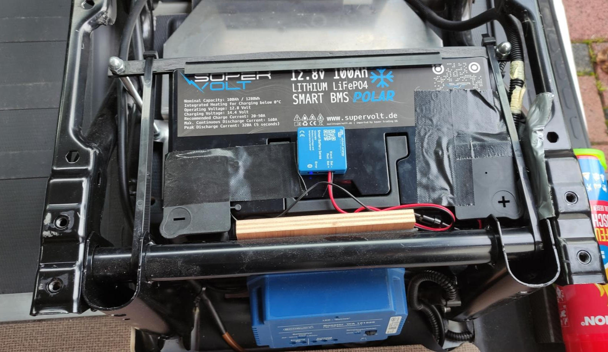

# WoMoAtor
## Einbau der Supervolt LiFePo4-Batterie

Der Austausch der zwei Original 95Ah AGM-Batterien durch eine 100Ah LiFePo4-Batterie von Supervolt war ohne Probleme durchzuführen.

Zunächst wurde der Sitz ausgebaut. Hier gibt es genug Anleitungen im Internet, so dass dies Problemlos erfolgen kann.

Danach wurden die beiden AGM-Batterien ausgebaut. Diese waren lediglich mit einem Bügel und 2 Schrauben gesichert. Wenn sie sich danach nicht entfernen lassen, muss man hinter dem Sitz evtl. die kleinen Haltebleche los schrauben. Vorsicht: die AGM-Batterien sind sehr schwer (Vor allem im Vergleich zur LifePo4)! 

Da die Supervolt-Batterie DIN-Maße hat, kann diese anschliessend einfach an die Stelle einer AGM-Batterie gesetzt werden. Auch die Anschlüsse sind identisch, so dass die Polklemmen auch direkt passen. Da vorher zwei AGM verbaut waren, musste ich noch das Verbindungskabel abklemmen.

Bei mir verschob sich der Haltebügel durch die fehlende zweite Batterie und ich habe ihn mit starken Kabelbindern zusätzlich fixiert.

Nach dem Einbau des Sitzes konnte die Batterie in Betrieb genommen werden. Die vorhandenen Ladegeräte sollten dann auf LiFePo4 umgestellt werden um die ideale Ladekurve zu fahren.

Es sollte ohne Probleme möglich sein auch zwei 150Ah Supervolt-Batterien zu verbauen. Bei der 100Ah-version ist neben der Batterie noch ca. 5cm Platz.

