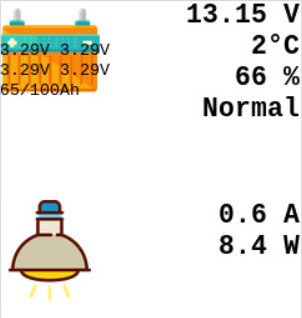

# Supervolt Modul
Mit diesem Python3-Modul ist es möglich die LiFePo4 Akkus von Supervolt auszulesen.

Raspberry:

Windows:

Die Icons sind von [SVGRepo](https://svgrepo.com/) bzw. [PNGRepo](https://pngrepo.com/) oder von [pixabay](https://pixabay.com)

Weitere Informationen zur Batterie: [Homepage von Supervolt](https://supervolt.de/)
