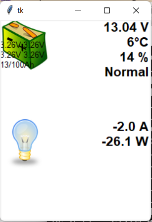

# Supervolt Modul
Mit diesem Python3-Modul ist es möglich die LiFePo4 Akkus von Supervolt auszulesen.

Unter Windows kann die [Windows-EXE-Datei](windows-bin/supervoltbatterygui.exe) direkt ausgeführt werden.

Die Konfiguration (incl. MAC) erfolgt über die Datei "config.json" im gleichen Verzeichnis wie die EXE-Datei.

Screenshot (Der Verbrauch ist negativ, da gearde geladen wird):

Die Icons sind von [pixabay](https://pixabay.com).

Weitere Informationen zur Batterie: [Homepage von Supervolt](https://supervolt.de/).
